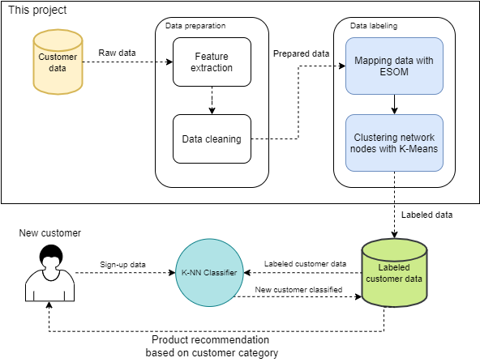
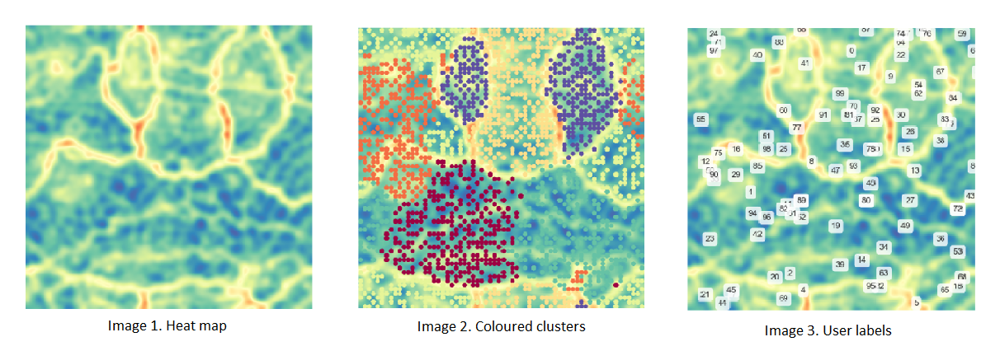
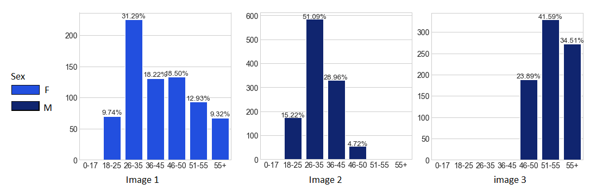

# Predicting consumer behaviour with ESOM and K-Means

Predicting user behaviour is one of most widespread uses of machine learning, it powers the recommendation engines on every possible service today.

Basic idea was to take user data, feed it to an unsupervised algorithm to find patterns in the data, and based on that – categorise users. Result would be user database where each user is placed in a specific category with other users that fit the same criteria. Finally, when all existing users fit into some category (they are labelled), new users can be classified in one of these categories based on their sign-up data. 

Project was made with a couple of Python libraries: *somoclu, sklearn, seaborn*. 

## Project goal

This project is a practical part of my bachelor’s thesis. Goal was to show the usage of machine learning models in predicting consumer behaviour. In order to achieve this, I used **Emergent Self-Organizing Maps** and **K-Means clustering** for data labelling and then **K-Nearest Neighbours** classifier to classify new data based on labelled data. The result was a proof-of-concept solution for recommending products to new customers based on no previous purchases.

## Dataset

Data used in this project was found on Kaggle, dataset name is – [Black Friday](https://www.kaggle.com/llopesolivei/blackfriday). It contains user data like age, gender, occupation, marital status and also their purchase data like: bought product ID and amount spent.

## ML pipeline description

Machine learning pipeline made in this project can be seen in a diagram bellow. Core part of the system is data labelling process, it uses ESOM and K-Means algorithms to find patterns and cluster the data. This technique is described in a paper by [Ultsch, et al., 2005](https://www.uni-marburg.de/fb12/arbeitsgruppen/datenbionik/pdf/pubs/2005/ultsch05esom).

**K** in **K-Means** is decided using Elbow method as described in this [article](https://medium.com/analytics-vidhya/how-to-determine-the-optimal-k-for-k-means-708505d204eb). After few trial runs, optimal number of categories was decided to be 6.

Models used:

* [**_Emergent Self-Organizing Map_ (ESOM)**](https://www.researchgate.net/publication/37683560_Emergence_in_Self_Organizing_Feature_Maps) - unsupervised neural network, based on Self-Organising Maps, used primarily for visualizing high dimensional data. In this case it is used in a way to recognise underlying structures in the data in a form of a heat map so that clustering algorithms can be run on the network.

* [**_K-Means Clustering_**](https://towardsdatascience.com/k-means-clustering-algorithm-applications-evaluation-methods-and-drawbacks-aa03e644b48a) - one of the most popular unsupervised ML algorithms. In this project it is used for clustering the nodes of ESOM neural network.

* [**_K-Nearest Neighbours_ (KNN)**](https://towardsdatascience.com/machine-learning-basics-with-the-k-nearest-neighbors-algorithm-6a6e71d01761) - very simple classifier. In this project it is used for classifying new customers based on existing, newly labelled customers.

It is important to note that KNN classifier can be exchanged for any other classifying algorithm. I just used KNN because of its simplicity and small dataset size.

## Results

First image below shows heat map of data density generated by ESOM network. Image 2 shows each found cluster coloured in different colour. And finally, Image 3 shows in which cluster do first 100 users belong.

Result of the data labelling was 6 unique user categories, each containing users with similar demographics. For example, in image bellow we can see that ESOM and K-Means recognised one category to be all adult women (Image 1). Other 2 images show “_Young adult men_” category (Image2) and “_Men over 45_” category.

